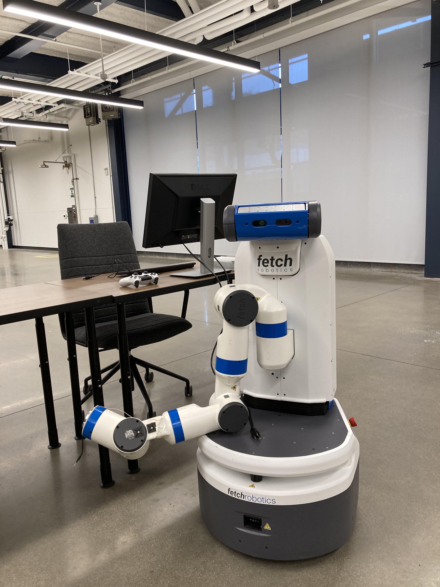
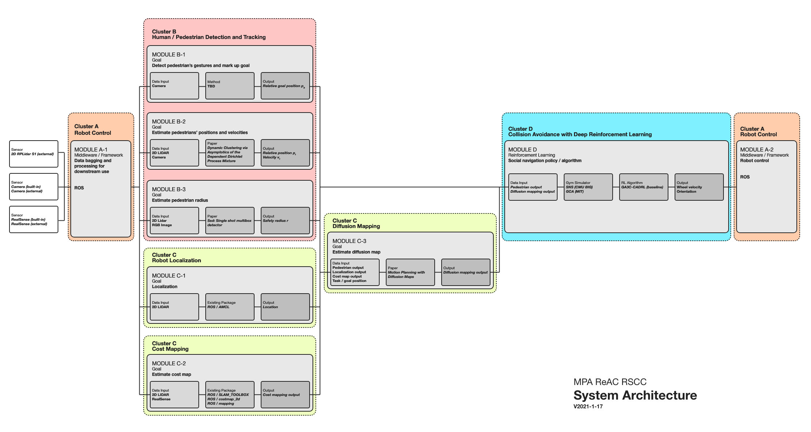
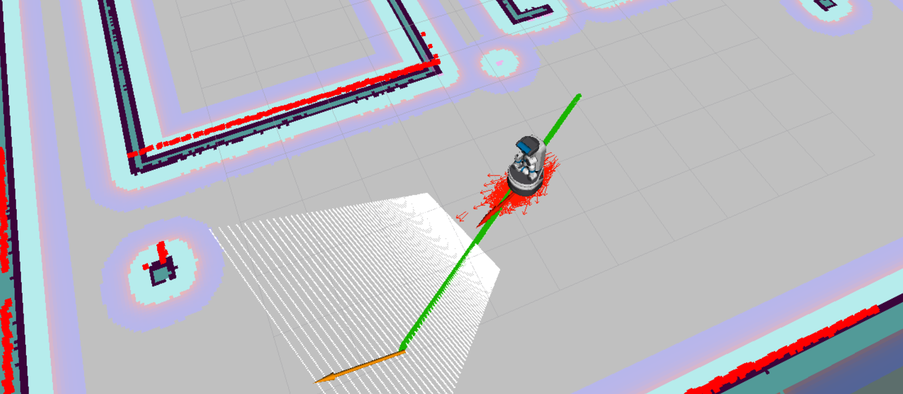

# Rethinking Automation in Construction (ReAC)

ReAC is a research group at Carnegie Mellon’s Computational Design Laboratory investigating ways of combining artificial intelligence and robotics to support building construction. The group's focus is on advancing a vision for humane uses of automation in constructionin through the design and development of "robot in the loop" adaptive systems that enhance and interact with (rather than replace) human expertise on site. Comprising faculty, graduate, and undergraduate students in the School of Architecture and Robotics Institute, the group is currently developing a software framework for robotically-assisted construction based on reinforcement learning methods, investigating human-machine interaction challenges specific to building contexts, and conducting qualitative studies of construction practices. 

## Project Series

### [(Current Work) Towards robotically-supported collaborative construction (RSCC)](page/rscc.md)

Our current work involves:

* Studying construction practices qualitatively in order to inform the design and development of robotic systems and directly involve builders and their concerns in their design;
* Developing a reinforcement learning-based framework for social navigation allowing robots to safely move in construction sites. RL is a special genre of machine learning (ML) well suited to operate in changing environments; 
* Engineering of a customized mobile ground robot uniquely suited for construction support.  

    
    
    
 The Fetch robot for prototyping 

    
    
 The system architecture 

    
    
 Collision avoidance navigation 

### [Prior work: Using Reinforcement Learning to Support Scalable Multi-Drone Construction in Dynamic Environments](page/drone.md)

An early prototype of tthis project comprised a framework for distributed robotically-assisted construction using reinforcement learning techniques to allow a variable number of drones to dynamically execute pick and place and spraycoating tasks. We tested the framework via simulations and started to refine a vision for computationally-supported construction processes.

    
    
 Multi-agent collision avoidance with reinforcement learning 

    
    
    
 The assembled drone with installed Raspberry Pi at CodeLab 

 

   
  
  
  
 Assembly of fabricated bricks with magnets attached 

<!-- 

<iframe width="560" height="315" src="https://www.youtube.com/embed/oe1T1j5nVqM" title="YouTube video player" frameborder="0" allow="accelerometer; autoplay; clipboard-write; encrypted-media; gyroscope; picture-in-picture" allowfullscreen></iframe>

 -->

## Publications

Yuning Wu, Emek Erdolu, Jean Oh and Daniel Cardoso Llach. Re-Thinking Automation in Construction: Towards Robotically-Supported Cooperative Construction. (Association for Computer Aided Design in Architecture, ACADIA, 2022 under review); 

Fang, Zhihao, Yuning Wu, Ammar Hassonjee, Ardavan Bidgoli, and Daniel Cardoso Llach. “Towards a Distributed, Robotically Assisted Construction Framework.” In Distributed Proximities (Association for Computer Aided Design in Architecture, ACADIA, Virtual, 2020). 

Wu, Yuning, Jieliang Luo, and Hui Li. "Learning Dense Reward with Temporal Variant Self-Supervision." arXiv preprint arXiv:2205.10431 (2022). 

## Reseach Team

* [Daniel Cardoso Llach, Ph.D.](http://dcardo.com), Associate Professor, School of Architecture, Carnegie Mellon University (PI);
* [Jean Oh, Ph.D.](https://www.cs.cmu.edu/~./jeanoh/), Senior Systems Scientist, Robotics Institute, Carnegie Mellon University (Co-PI);
* [Yuning Wu](https://ice-5.github.io), Ph.D. Student, Computational Design / M.S., Machine Learning;
* [Emek Erdolu], Ph.D. Candidate, School of Architecture, Computational Design;
* [Jiaying Li], M.S. Candidate, School of Architecture, Computational Design;
* [Abhishek Singh], Masters of Information Systems Candidate, School of Engineering;
* [Yuchen Liu], M.S. Candidate, School of Architecture, Computational Design. 

## Alumni

* [Zhihao Fang](https://github.com/SakuraiSatoru), M.S., Computational Design.
* [Ardavan Bidgoli](https://www.ardavan.io/), Ph.D. Candidate, Computational Design. 
* [Ammar Hassonjee](https://github.com/ahassonj), B.Arch. Student.
* Willa Yang M.S. Student, Computational Design.
* Yanwen Dong, M.S. Student, Computational Design.

## Industry Partners

* PJ Dick
* Module 

