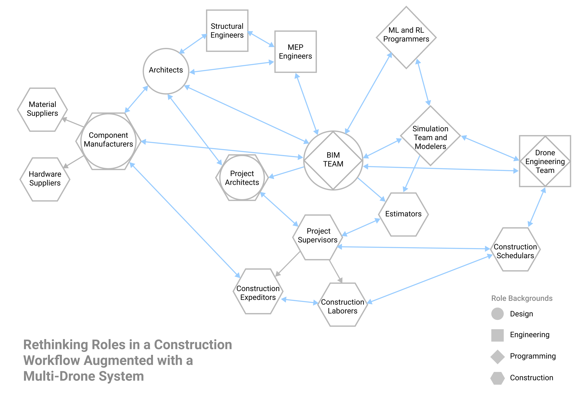
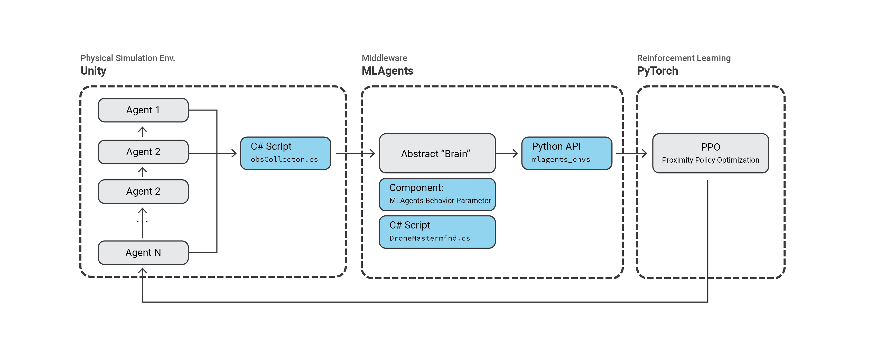

# Rethinking Automation in Construction
Research Team: [Zhihao Fang](https://github.com/SakuraiSatoru), [Yuning Wu](https://github.com/ICE-5), [Ammar Hassonjee](https://github.com/ahassonj), [Ardavan Bidgoli](https://www.ardavan.io/), Michael Hasey, Willa Yang, Yanwen Dong, Prof. [Daniel Cardoso-Llach](https://soa.cmu.edu/daniel-cardoso-llach). 

## An Architectural Framework for Distributed Semi-Autonomous Construction 
### Using Reinforcement Learning to Support Scalable Multi-Drone Construction in Dynamic Environments

#### [Presentation Link](https://docs.google.com/presentation/d/12oNLmjrZbbdthgC6_SSjJvmG4bwvcLlHvFmcy8rDtmo/edit?usp=sharing)

Recent research in the field of autonomous construction has explored the feasibility of utilizing drones in construction tasks including, but not limited to, bricklaying [1], frame structure assembly [2], 3D printing [3], tensile structure weaving [4], nailing [5], spraying [6], and site data collection [7]. Alongside the new tectonic possibilities afforded by robotic construction, these efforts have immense potential to reduce costs, increase efficiency, and accuracy in building construction.

An important limitation of these approaches is that they have been mostly tested in controlled, laboratory environments. Thus, the dynamic conditions of actual construction sites are either overlooked or significantly simplified. A second limitation is that the focus on “autonomy” has led to systems that fail to recognize the plurality of human roles involved in computational design and construction workflows [Assisted Automation + Machinic Surrogates]. Addressing these limitations, in this project we introduce a reinforcement learning-based (RL-based) approach to scalable semi-autonomous construction that takes into account the dynamic nature of construction environments, and the human labors involved in their production. We present a software framework that allows for the planning and simulation of simple additive construction tasks by multiple drones under changing environmental and resource conditions, and demonstrate it through a series of simulations and a proof-of-concept implementation. The implementation comprises a series of pick-and-place tasks conducted outdoors by a small swarm of drones under different environmental conditions. Our approach contributes to ongoing research into architectural and design robotics by demonstrating a usable framework for architects to orchestrate robotic building tasks.

This project aims to specifically develop a decentralized reinforcement learning control framework based on sensory input with a central server 
for dispatching tasks that therefore can support multi-drone coordination for architectural construction, and thus enable more complex human-machine construction processes.
The technical framework consists of a central server for task scheduling, progress monitoring, and drone management. Each individual drone is equipped with an RL-based navigation algorithms for collision avoidance, and macro-actions, which are sequences of action steps geared to accomplishing tasks including building, resupplying, and charging. 
After the server assigns a drone its related construction task, it operates in a decentralized fashion to make the system more scalable. The drone goes to the supply station for resupply, navigates to the designated target position to build, then depending on its remaining battery, it will issue another task request, or go to the charge station for battery charging.

**Table of Contents**

- [Status](#Status)
- [RL Algorithm Details](#Reinforcement_Learning_Algorithm_Details)
- [Training Model and Results](#Training_Model_and_Results)
- [Drone Hardware and Building Components](#Drone_Hardware_and_Building_Components)
- [Simulation](#Simulation)
- [Human and Drone Relationships](#Human-Drone_Relationships)
- [Next Steps](#Next_Steps)
- [Acknowledgments](#Acknowledgments)

## Status

This project is currently under development in three phases:

1. Code development and RL Algorithm Training Advancement
    - [ ] Training more drone agents to be able to autonomously detect collisions
2. Developing the system to run in Unity
3. Experimenting with the physical fabrication side of crafting drone-compatible building components as well as preparing the drone hardware.

## Reinforcement_Learning_Algorithm_Details

We use a particular kind of reinforcement learning algorithm called  Proximal Policy Optimization, or PPO for short, to learn the policy of how drones can 
approach a target while avoiding collision with other drones. Essentially, the PPO algorithm is a policy gradient-based optimization that uses a neural network 
to resemble the policy. The network is updated using a composite loss that takes into account of generalized advantage estimation, GAE,  in a clipped manner. 
Our neural network architecture uses convolutional layers to combine encodings of different kinds of input, namely lidar, goal position, 
and agent velocity. For better generalization, we also added Gaussian sampling to the output.

    
    
    
 Diagrams depicting the PPO process 

    
    
 Technical framework overview 

### Training_Model_and_Results

We use a two-stage training method to learn the policy in a curriculum learning fashion. In the first stage we trained on 5 agents 
while in the second stage we trained on 10 agents and introduced some threat areas. We use 20 agents for evaluation, as shown in the GIF below, and the result demonstrates the 
scalability of the algorithm.

    

## Drone_Hardware_and_Building_Components

We opted to make a build a custom-made drone to the required specs. It relies on a Pixhawk to control its flight, a Raspberry Pi for on the edge computations 
and communication with the centralized computer. It is also equipped with electromagnets to pick and place foam blocks. 
At its final setup, it can use a lidar or depth camera to scan the environment. Our next steps are to figure out the flight control and tracking system. The current proposed
method for this is to use Aruco markers on each drone.

    
    
    
 The assembled drone with installed Raspberry Pi 

Drones usually don’t stay in a fixed position when flying due to external factors like wind, and this difference between a drone’s simulated location versus its physical
locations can cause building components to be placed in incorrect locations. So to account for these discrepancies, we experimented with different 
brick designs to be used in our pick and placement procedure with key additions, which are shown in the images and gifs below. 

   
  
  
  
 Assembly of fabricated bricks with magnets attached 

### Simulation

Below you can click to see a video simulation demo of the framework in action. The simulation below runs in the Rhino model space and shows a sample bricklaying procedure completed by 10 drone agents.

## Human-Drone_Relationships

Our proposed framework aims at a more comprehensive workflow that not only encompases the drones, but also the full pipeline that they work within consisting of a variety of
different construction roles. We illustrate our long term idea of a project workflow from the design development stages, involving roles such as architects and engineers, to the building construction phases integrated with our proposed multi-drone framework.

   
  
  
  
 Left: Long-term Project Workflow | Right: Human Roles in the Framework

With the specific project workflow shown above, the number of roles involved and necessary interactions among roles resembles a complex web in order to keep data consistent, emphasize communication, and ensure the project runs smoothly.
Because of the many roles involved, a central model and dedicated BIM team is incredibly important to the project's flow as they provide a single accessible model from where different parties can access and reference information.

Regarding the technical workflow of this entire project pipeline, the diagram below shows the various interfaces used by the different roles and how they can be integrated together to utlize and monitor a multi-drone system for different construction tasks. 
Architectural designers, engineers, and manufacturers will most likely continue to use CAD modeling software, such as Rhino, for design development. 
The BIM team then imports these models into a BIM software like Revit. Afterwards, programmers can access the BIM model to program the drone’s pick and placement procedure using visualization interfaces like Unity. Once the program is finished and starts running, on site project managers can use a custom UI plugin to monitor progress and stop the drone operation in case of emergencies or errors. 

   
  
  
Technical Interfaces and Human Roles

### Next_Steps

For future steps, we are pushing the current pipeline into a more universal, scalable platform that further integrates simulation with real-time RL training and inference, 
and a seamless communication API for different environments. We are using Unity as our first testbed. With the help of MLagents as middleware, we 
are able to establish a fluent workflow between the environment and PyTorch model. We are also expanding our library of algorithm to prepare for enhanced 
performance in diverse scenarios. Some candidate multi-agent reinforcement learning algorithms include MADDPG, DDPG, Central-Q, Central-V, etc.

   
  
  
Evolving the Framework

### Acknowledgments

We would like to thank [Computational Design Lab](http://code.arc.cmu.edu/) (CoDe Lab) for its generous support. 
We would also like to express our gratitude towards the [Design Fabrication Lab](https://soa.cmu.edu/dfab) (DFab) at the School of Architecture, CMU for their help with fabrication. 

### Citations

Please check back later for citations as we are in the process of writing our paper.

