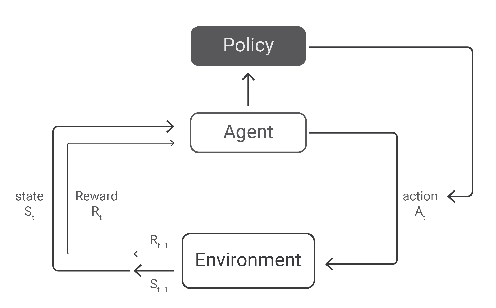
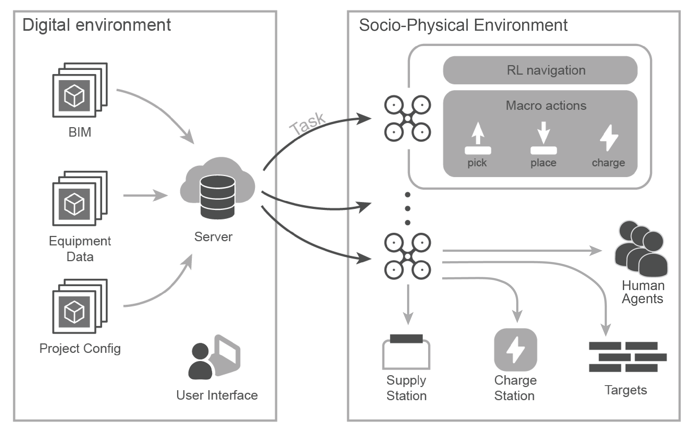
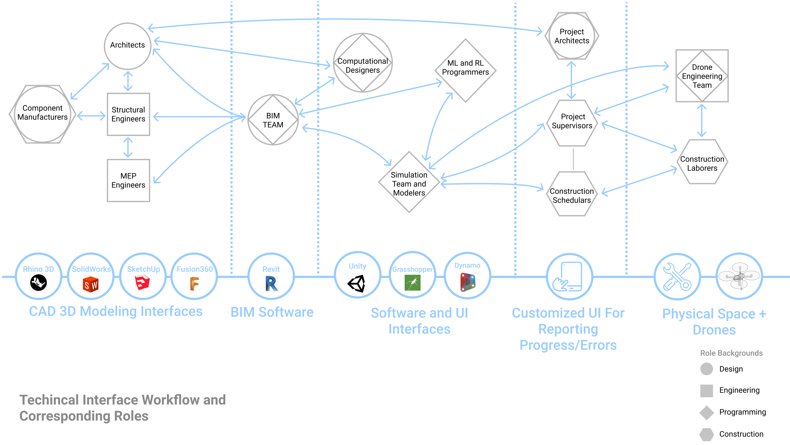

# Rethinking Automation in Construction (RAiC)

RAiC is a research group at Carnegie Mellon’s Computational Design Laboratory investigating ways of combining artificial intelligence and robotics to support building practices. We are interested in developing adaptive systems that enhance and interact with human expertise on site, articulating a vision for human-machine construction ecologies that does not aspire to full automation. Comprising faculty, graduate, and undergraduate students, the group is currently developing a software framework for robotically-assisted construction based on reinforcement learning methods, and investigating human-machine interaction challenges specific to building contexts. Some preliminary results are forthcoming in an ACADIA 2021 paper. We are also in the early stages of an industry collaboration that will allow us to test our framework in the context of modular construction manufacturing.

## Team

* [Daniel Cardoso Llach, Ph.D.](http://dcardo.com), Associate Professor, School of Architecture, Carnegie Mellon University (PI). 
* [Ardavan Bidgoli](https://www.ardavan.io/), Ph.D. Candidate, Computational Design.
* [Yuning Wu](https://ice-5.github.io), Ph.D. Student, Computational Design / M.S., Machine Learning.
* [Zhihao Fang](https://github.com/SakuraiSatoru), M.S., Computational Design.
* [Ammar Hassonjee](https://github.com/ahassonj), B.Arch. Student.
* Willa Yang, M.S. Student, Computational Design.
* Yanwen Dong, M.S. Student, Computational Design.

## Collaborators
* [Jean Oh, Ph.D.](https://www.cs.cmu.edu/~./jeanoh/), Senior Systems Scientist, Robotics Institute, Carnegie Mellon University (Co-PI).
* iBUILT 

### Using Reinforcement Learning to Support Scalable Multi-Drone Construction in Dynamic Environments

Recent research in the field of architectural and construction robotics has explored robots’ potential to support construction tasks including, bricklaying, frame structure assembly, 3D printing, tensile structure weaving, nailing, spraying, and site data collection. However, a common limitation of these approaches is their lack of generalizability and scalability, as well as the assumption that drones work under highly controlled environments in isolation from human builders and environmental changes. In this paper we document progress towards an architectural framework for distributed robotically-assisted construction that takes into account the environmental and social dynamism of construction sites. We draw from state-of-the-art reinforcement learning techniques to propose a software framework allowing for a variable number of drones to dynamically execute pick and place and spraycoating tasks. Documenting the framework for robotically-assisted construction through simulations and a proof-of-concept outline, this paper contributes to current research in architectural and construction robotics, and advances a vision for semi-autonomous construction ecosystems interfacing humans and computational systems.

#### [Presentation Link](https://docs.google.com/presentation/d/1-imEgwLdAeAg5kXq88B_MKbri-ZCLNCWNqa8yrZAHec/edit?usp=sharing)

This project is currently under development in three phases:

1. Code development and RL Algorithm Training Advancement
    - [ ] Training more drone agents to be able to autonomously detect collisions
2. Developing the system to run in Unity
3. Experimenting with the physical fabrication side of crafting drone-compatible building components as well as preparing the drone hardware.

## Reinforcement_Learning_Algorithm_Details

We use a particular kind of reinforcement learning algorithm called  Proximal Policy Optimization, or PPO for short, to learn the policy of how drones can 
approach a target while avoiding collision with other drones. Essentially, the PPO algorithm is a policy gradient-based optimization that uses a neural network 
to resemble the policy. The network is updated using a composite loss that takes into account of generalized advantage estimation, GAE,  in a clipped manner. 
Our neural network architecture uses convolutional layers to combine encodings of different kinds of input, namely lidar, goal position, 
and agent velocity. For better generalization, we also added Gaussian sampling to the output.

    
    
    
 Diagrams depicting the PPO process 

    
 Image on the right from Long, Pinxin "Towards optimally decentralized multi-robot collision avoidance via deep reinforcement learning" (2018) 

    
    
 Technical framework overview 

    
 Image taken from Zhihao Fang's thesis: "Towards multi-drone autonomous construction via deep reinforcement learning" (2020) 

### Training_Model_and_Results

We use a two-stage training method to learn the policy in a curriculum learning fashion. In the first stage we trained on 5 agents 
while in the second stage we trained on 10 agents and introduced some threat areas. We use 20 agents for evaluation, as shown in the GIF below, and the result demonstrates the 
scalability of the algorithm.

    

## Drone_Hardware_and_Building_Components

We opted to make a build a custom-made drone to the required specs. It relies on a Pixhawk to control its flight, a Raspberry Pi for on the edge computations 
and communication with the centralized computer. It is also equipped with electromagnets to pick and place foam blocks. 
At its final setup, it can use a lidar or depth camera to scan the environment. Our next steps are to figure out the flight control and tracking system. The current proposed
method for this is to use Aruco markers on each drone.

    
    
    
 The assembled drone with installed Raspberry Pi 

Drones usually don’t stay in a fixed position when flying due to external factors like wind, and this difference between a drone’s simulated location versus its physical
locations can cause building components to be placed in incorrect locations. So to account for these discrepancies, we experimented with different 
brick designs to be used in our pick and placement procedure with key additions, which are shown in the images and gifs below. 

   
  
  
  
 Assembly of fabricated bricks with magnets attached 

### Simulation

Below you can click to see a video simulation demo of the framework in action. The simulation below runs in the Rhino model space and shows a sample bricklaying procedure completed by 10 drone agents.

## Human-Drone_Relationships

Our proposed framework aims at a more comprehensive workflow that not only encompases the drones, but also the full pipeline that they work within consisting of a variety of
different construction roles. We illustrate our long term idea of a project workflow from the design development stages, involving roles such as architects and engineers, to the building construction phases integrated with our proposed multi-drone framework.

   
  
  
  
 Left: Long-term Project Workflow | Right: Human Roles in the Framework

With the specific project workflow shown above, the number of roles involved and necessary interactions among roles resembles a complex web in order to keep data consistent, emphasize communication, and ensure the project runs smoothly.
Because of the many roles involved, a central model and dedicated BIM team is incredibly important to the project's flow as they provide a single accessible model from where different parties can access and reference information.

Regarding the technical workflow of this entire project pipeline, the diagram below shows the various interfaces used by the different roles and how they can be integrated together to utlize and monitor a multi-drone system for different construction tasks. 
Architectural designers, engineers, and manufacturers will most likely continue to use CAD modeling software, such as Rhino, for design development. 
The BIM team then imports these models into a BIM software like Revit. Afterwards, programmers can access the BIM model to program the drone’s pick and placement procedure using visualization interfaces like Unity. Once the program is finished and starts running, on site project managers can use a custom UI plugin to monitor progress and stop the drone operation in case of emergencies or errors. 

   
  
  
Technical Interfaces and Human Roles

### Next_Steps

For future steps, we are pushing the current pipeline into a more universal, scalable platform that further integrates simulation with real-time RL training and inference, and a seamless communication API for different environments. We are using Unity as our first testbed. With the help of MLagents as middleware, we 
are able to establish a fluent workflow between the environment and PyTorch model. We are also expanding our library of algorithm to prepare for enhanced 
performance in diverse scenarios. Some candidate multi-agent reinforcement learning algorithms include MADDPG, DDPG, Central-Q, Central-V, etc.

   
  
  
Evolving the Framework

