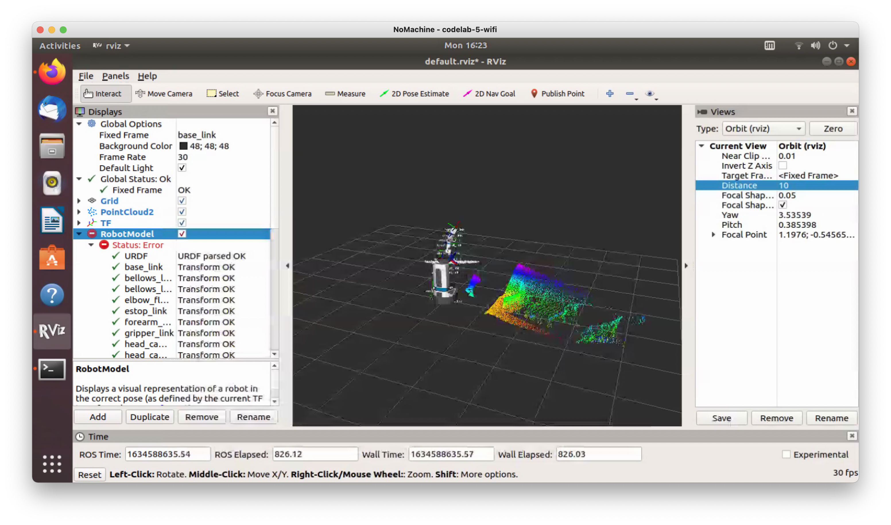

# Rethinking Automation in Construction (ReAC)

ReAC is a research group at Carnegie Mellon’s Computational Design Laboratory investigating new ways of combining artificial intelligence and robotics techniques to support building construction. The group's focus is on advancing a vision for humane uses of automation in construction through the design and development of "robot in the loop" adaptive systems that enhance and interact with (rather than purporting to replace) human labor on site. Comprising faculty, graduate, and undergraduate students in the School of Architecture and Robotics Institute, the group is currently developing a software framework for robotically-assisted construction based on reinforcement learning methods, investigating human-machine interaction challenges specific to building contexts, and conducting qualitative studies at building sites and modular construction facilities. 

Our current work involves:

* Studying construction practices qualitatively in order to inform the design and development of robotic systems and directly involve builders and their concerns in their design;
* Developing a reinforcement learning-based framework for social navigation allowing robots to safely move in construction sites; 
* Engineering of a customized mobile ground robot uniquely suited for construction support.  

    
    
 The Fetch robot for prototyping 

    
    
 The system architecture 

    
    
 Collision avoidance navigation 

## Publications

The ReAC group has contributed to construction robotics, intelligent robotics, and architectural computing literature. Below is a list of selected peer reviewed articles published by the group. 

* Wu, Yuning, Emek Erdolu, Jiaying Wei, Jean Oh, and Daniel Cardoso Llach. 2024. “Robot in the Loop: A Human-Centered Approach to Contextualizing AI and Robotics in Construction.” Construction Robotics 9 (1): 1. https://doi.org/10.1007/s41693-024-00144-8.
* Wu, Yuning, Jiaying Wei, Jean Oh, and Daniel Cardoso Llach. 2024. “Towards Human-Centered Construction Robotics: A Reinforcement Learning-Driven Companion Robot for Contextually Assisting Carpentry Workers.” In 2024 IEEE/RSJ International Conference on Intelligent Robots and Systems (IROS), 90–97. https://doi.org/10.1109/IROS58592.2024.10802698.
* Stoler, Benjamin, Meghdeep Jana, Soonmin Hwang, and Jean Oh. 2023. “T2FPV: Dataset and Method for Correcting First-Person View Errors in Pedestrian Trajectory Prediction.” In 2023 IEEE/RSJ International Conference on Intelligent Robots and Systems (IROS), 4037–44. https://doi.org/10.1109/IROS55552.2023.10341874.
* Wu, Yuning, Jieliang Luo, and Hui Li. 2022. “Learning Dense Reward with Temporal Variant Self-Supervision.” arXiv. https://doi.org/10.48550/arXiv.2205.10431.
* Fang, Zhihao, Yuning Wu, Ammar Hassonjee, Ardavan Bidgoli, and Daniel Cardoso Llach. 2020. “Towards a Distributed, Robotically Assisted Construction Framework.” In Distributed Proximities. Online + Global. link to article.

## Reseach Team

* [Daniel Cardoso Llach, Ph.D.](http://dcardo.com), Associate Professor, School of Architecture, Carnegie Mellon University (PI);
* [Jean Oh, Ph.D.](https://www.cs.cmu.edu/~./jeanoh/), Senior Systems Scientist, Robotics Institute, Carnegie Mellon University (Co-PI);

## Faculty Collaborators

* Dina El Zanfaly, Assistant Professor, School of Design, Carnegie Mellon University 

## Alumni

* [Yuning Wu](https://ice-5.github.io), Ph.D. 2024, Computational Design / M.S., Machine Learning;
* Emek Erdolu, Ph.D. 2024, School of Architecture, Computational Design;
* Jiaying Wei, Ph.D. Candidate, School of Architecture, Computational Design;
* Abhishek Singh, Masters of Information Systems Candidate, School of Engineering;
* Yuchen Liu, M.S. Candidate, School of Architecture, Computational Design. 
* [Zhihao Fang](https://github.com/SakuraiSatoru), M.S. 2022, Computational Design.
* [Ardavan Bidgoli](https://www.ardavan.io/), Ph.D. 2023, Computational Design. 
* [Ammar Hassonjee](https://github.com/ahassonj), B.Arch. Student.
* Willa Yang M.S. Computational Design 2023.
* Yanwen Dong, M.S. Computational Design 2023.

## Industry Partners

* PJ Dick
* Module 

## Sponsors

* Manufacturing Futures Initiative (2022-2023);
* Pennsylvania Agency for Economic Development - PAMIP (2021-2022);
* Google's Artist + Machine Intelligence Program (2021-2022).
* Autodesk

